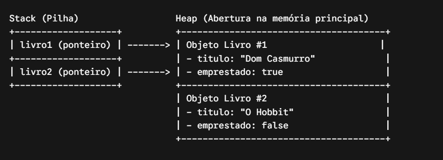

# Classes e Objetos

## O que é?

A metáfora clássica funciona perfeitamente aqui:
- Classe: É a planta baixa (o molde/template). Ela define quais atributos (características) e quais métodos (comportamentos) algo terá.
- Objeto: É a casa construída em si (a instância). É o elemento real que ganha vida na memória RAM do computador quando você usa a palavra-chave new.

---

## Entendimento

### Classe (O Molde)
Uma classe agrupa atributos (dados) e métodos (ações). Aplicando o que vimos de modificadores de acesso, fechamos os atributos com private e abrimos o acesso controlado com métodos públicos (Encapsulamento).


```java
package com.sistema.biblioteca;

public class Livro {
    
    // 1. Atributos (Estado do objeto) - Privados por segurança
    private String titulo;
    private String autor;
    private boolean emprestado;

    // 2. Construtor (Como o objeto é criado na memória)
    public Livro(String titulo, String autor) {
        this.titulo = titulo;
        this.autor = autor;
        this.emprestado = false; // Todo livro começa disponível
    }

    // 3. Comportamentos (Métodos)
    public void emprestar() {
        if (!this.emprestado) {
            this.emprestado = true;
            System.out.println("Livro '" + titulo + "' emprestado com sucesso!");
        } else {
            System.out.println("O livro '" + titulo + "' já está emprestado.");
        }
    }

    // Getters para leitura dos dados
    public String getTitulo() {
        return titulo;
    }

    public boolean isEmprestado() {
        return emprestado;
    }
}
```

### O Objeto (A Instância na Memória)

Criar um objeto a partir de uma classe é chamado de instanciação. Você pode criar N objetos diferentes usando a mesma classe:

```java
public class Main {
    public static void main(String[] args) {
        
        // Instanciando 2 objetos distintos na memória Heap do Java
        Livro livro1 = new Livro("Dom Casmurro", "Machado de Assis");
        Livro livro2 = new Livro("O Hobbit", "J.R.R. Tolkien");

        // Executando ações nos objetos
        livro1.emprestar(); // "Livro 'Dom Casmurro' emprestado com sucesso!"
        livro1.emprestar(); // "O livro 'Dom Casmurro' já está emprestado."

        // O estado de livro2 permanece intocado
        System.out.println("O Hobbit está emprestado? " + livro2.isEmprestado()); // false
    }
}
```
---

## O que acontece sob o capô (Memória JVM)?



- Na Stack, o Java guarda apenas a variável de referência (livro1).
- Na Heap, reside o objeto real com seus dados.

💡 Ponto de atenção: Se você fizer Livro livro3 = null; e tentar executar livro3.emprestar(), você toma o famoso NullPointerException, pois a referência na Stack não aponta para nenhum objeto alocado na Heap.


---