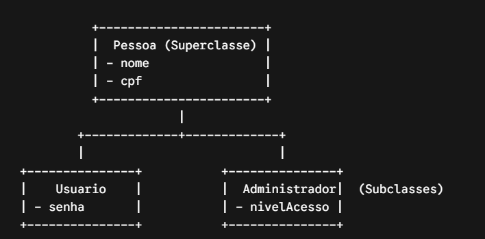

# Herança

## O que é?
Herança é o mecanismo que permite que uma classe reaproveite atributos e comportamentos de outra. Ela estabelece uma relação do tipo "é um" (is-a).

---

## O Conceito Na Prática

Em vez de duplicar código criando varias classes com os mesmos campos (ex: cpf, nome, email), você extrai o que é comum para uma superclasse (classe mãe) e faz as subclasses (classes filhas) herdarem dela usando a palavra-chave extends.



## Código em Java

### 1 - Superclasse(Mãe)
Repare no uso do modificador protected: ele permite que a classe filha acesse o campo diretamente se necessário, mantendo o acesso privado para o restante do sistema.
```java
public class Usuario {
    
    protected String nome;
    protected String email;

    public Usuario(String nome, String email) {
        this.nome = nome;
        this.email = email;
    }

    public void logar() {
        System.out.println("Usuário " + nome + " fez login no sistema.");
    }
}
```
### 2. A Subclasse (Filha)

Usamos extends para herdar e super() para reaproveitar o construtor da mãe.

```java
public class AnalistaSuporte extends Usuario {

    private String nivelAcesso; // Atributo exclusivo do Analista

    public AnalistaSuporte(String nome, String email, String nivelAcesso) {
        // 1. Chama o construtor da classe mãe (Usuario)
        super(nome, email); 
        this.nivelAcesso = nivelAcesso;
    }

    // Método exclusivo
    public void atenderChamado(Long chamadoId) {
        System.out.println("Analista " + nome + " (" + nivelAcesso + ") atendendo chamado #" + chamadoId);
    }
}
```


### Executando o Código

O objeto filho herda tudo o que é público ou protected da mãe:
```java
public class Main {
    public static void main(String[] args) {
        
        AnalistaSuporte suporte = new AnalistaSuporte("Lucas", "lucas@empresa.com", "Nível 1");

        // Método herdado da classe Usuario
        suporte.logar(); // Output: Usuário Lucas fez login no sistema.

        // Método próprio da classe AnalistaSuporte
        suporte.atenderChamado(1042L); // Output: Analista Lucas (Nível 1) atendendo chamado #1042
    }
}
```

## 3 Regras de Ouro da Herança em Java

- Herança Simples: Em Java, uma classe só pode estender uma única classe (extends Usuario). Não existe herança múltipla de classes (para simular isso, usamos Interfaces).
- Uso da palavra super: Usada para referenciar o construtor (super(...)) ou métodos da superclasse (super.logar()).
- Sobrescrita de Métodos (@Override): A classe filha pode redefinir o comportamento de um método herdado da mãe para adaptar à sua necessidade.

```java
@Override
public void logar() {
    System.out.println("Analista " + nome + " logou com autenticação de dois fatores.");
}
```

- 💡 Ponto de Atenção: Cuidado com o acoplamento. Use herança apenas quando a relação for estritamente "é um" (ex: AnalistaSuporte é um Usuario). Se a relação for "tem um" (ex: Usuario tem um Endereco), o correto é usar Composição (injetar a classe Endereco dentro de Usuario).


---