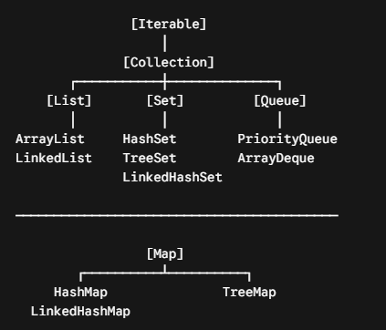

# Collections Framework

## O que é?
É um conjunto de classes e interfaces pronto para uso que implementa as estruturas de dados mais comuns (listas, conjuntos, filas, mapas).
Ele foi desenhado exatamente sob os princípios de Clean Code, DRY e KISS: em vez de você reescrever do zero um algoritmo de ordenação ou uma estrutura de dados toda vez que precisa armazenar elementos, a linguagem oferece uma API padronizada, performática e fácil de ler.---

## Hierarquia

A arquitetura do Collections Framework se divide em duas interfaces raiz principais: Collection (para grupos de objetos individuais) e Map (para pares de chave-valor).

## Principais interfaces

### 1. List (Listas)
Coleção ordenada (mantém a ordem de inserção) e que permite elementos duplicados.
- ArrayList: Implementado com um array dinâmico por baixo dos panos. Busca elementos pelo índice em tempo constante $O(1)$. É a escolha padrão (KISS) para 90% dos casos.
- LinkedList: Implementado como lista duplamente encadeada. É melhor para cenários com muitas inserções e remoções no meio da lista, mas pior para busca.

### 2. Set (Conjuntos)
Coleção de elementos únicos (não permite duplicatas). Ideal para garantir que não existam itens repetidos (como IDs, CPF, e-mails).
- HashSet: A mais performática $O(1)$. Não garante nenhuma ordem dos elementos.
- TreeSet: Mantém os elementos ordenados (ordem natural ou via Comparator), mas a inserção/busca é mais lenta $O(\log n)$.
- LinkedHashSet: Mantém a ordem de inserção dos elementos, sem aceitar duplicatas.

### 3. Map (Mapas / Dicionários)
Mapeia chaves para valores. As chaves não podem ser duplicadas, mas os valores podem. (Nota: Map não estende a interface Collection, mas faz parte do framework).
- HashMap: Busca e inserção de altissima performance $O(1)$. Sem ordem garantida.TreeMap: Mantém as chaves ordenadas.
- LinkedHashMap: Preserva a ordem de inserção das chaves.

### 4. Queue e Deque (Filas e Filas Duplas)
Para processamento de elementos em ordens específicas, como FIFO (First-In, First-Out) ou LIFO (Last-In, First-Out).
- PriorityQueue: Processa elementos com base em prioridade (usando um Heap).
- ArrayDeque: Implementação muito eficiente de pilha (stack) ou fila simples.

## Tabela de decisão

|                 Se você precisa de...                  | Qual interface usar?  |    Qual implementação escolher por padrão?     |
|:------------------------------------------------------:|:---------------------:|:----------------------------------------------:|
|       Lista simples com acesso rápido via índice       |        `List`         |                  `ArrayList`                   |
|      Evitar itens duplicados sem importar a ordem      |         `Set`         |                   `HashSet`                    |
|  Evitar itens duplicados mantendo os dados ordenados   |         `Set`         |                   `TreeSet`                    |
|      Estrutura do tipo Chave $\rightarrow$ Valor       |         `Map`         |                   `HashMap`                    |
|  Processar tarefas por ordem de chegada ou prioridade  |        `Queue`        |         `ArrayDeque` / `PriorityQueue`         |

## Boas práticas

### 1. Programe para a Interface (Polimorfismo)
Declare a variável usando a interface e instancie a classe concreta. Isso facilita trocar a implementação no futuro sem quebrar o resto do código.
- ❌ Ruim: ArrayList<String> nomes = new ArrayList<>();
- ✅ Bom: List<String> nomes = new ArrayList<>();

### 2. Escolha a Capacidade Inicial se Souber o Tamanho
Por padrão, um ArrayList ou HashMap começa pequeno e vai redimensionando o array interno conforme cresce (o que exige cópia de memória). Se você sabe que a lista terá 1000 itens:
- ✅ Bom: List<Usuario> usuarios = new ArrayList<>(1000);

### 3. Cuidado com equals() e hashCode()
Para classes customizadas usadas em Set ou como chave de um Map, é obrigatório sobrescrever corretamente os métodos equals() e hashCode(). Se não fizer isso, o Java usará o endereço de memória, gerando comportamentos bizarros onde o HashSet aceita objetos duplicados.

(Dica moderna: Usar record no Java resolve isso automaticamente, pois o compilador gera equals e hashCode baseados em todos os campos)

---
