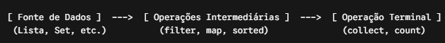

# Stream API

## O que é?
A Stream API (introduzida no Java 8) é uma abstração para processamento declarativo de sequências de elementos (como coleções).
Em vez de escrever laços explícitos (`for` ou `while`) e controlar o estado manualmente, você declara o que deseja fazer com os dados através de pipeline de operações.

---

## Estrutura do Pipeline de um Stream
Um pipeline de Stream é composto por três partes fundamentais:


- Fonte (Source): Criação do Stream a partir de uma coleção, array ou I/O.
- Operações Intermediárias (Lazy): Transformam o Stream em outro Stream. Elas não executam imediatamente; apenas constroem o plano de execução.
- Operação Terminal (Eager): Executa todo o pipeline e produz um resultado final (uma lista, um número, um Optional, etc.) ou um efeito colateral (forEach).

## Principais Operações
### 1. Operações Intermediárias
- `filter(Predicate<T>)`: Filtra elementos com base em uma condição boolean.
- `map(Function<T, R>)`: Transforma cada elemento em outro tipo ou valor.
- `sorted()` / `sorted(Comparator)`: Ordena os elementos.
- `distinct()`: Remove elementos duplicados (baseado em `equals`).
- `flatMap(Function<T, Stream<R>>)`: Achata estruturas aninhadas (ex: `List<List<T>>` vira `Stream<T>`).


### 2. Operações Terminais
- `collect(Collectors.toList())` / `.toList()`: Agrupa os elementos processados (Java 16+ suporta .toList() direto).
- `reduce()`: Combina todos os elementos em um único valor acumulado (ex: soma ou multiplicação).
- `findFirst()` / `findAny()`: Retorna um `Optional` do elemento encontrado.
- `anyMatch()` / `allMatch()` / `noneMatch()`: Verificações booleanas.
- `count()`: Retorna a quantidade total de elementos.

## Exemplo Prático Completo
Imagine filtrar uma lista de produtos, pegando apenas os ativos, aplicando um desconto e agrupando em uma nova lista:

```java
record Produto(String nome, double preco, boolean ativo) {}

List<Produto> produtos = List.of(
    new Produto("Notebook", 3500.0, true),
    new Produto("Mouse", 80.0, true),
    new Produto("Teclado", 150.0, false),
    new Produto("Monitor", 1200.0, true)
);

// Pipeline com Stream API
List<String> nomesProdutosComDesconto = produtos.stream()
    .filter(Produto::ativo)                         // Intermediária: Filtra apenas ativos
    .filter(p -> p.preco() > 100.0)                 // Intermediária: Preço > 100
    .map(p -> p.nome().toUpperCase())               // Intermediária: Transforma nome em MAIÚSCULAS
    .sorted()                                       // Intermediária: Ordena alfabeticamente
    .toList();                                      // Terminal: Coleta em uma List imutável

System.out.println(nomesProdutosComDesconto); // [MONITOR, NOTEBOOK]
```

## Operações Avançadas com `Collectors`
O `Collectors` oferece agrupamentos e sumarizações complexas:

```java
// 1. Agrupar por propriedade (Group By)
Map<Boolean, List<Produto>> porStatus = produtos.stream()
    .collect(Collectors.partitioningBy(Produto::ativo));

// 2. Somar ou calcular média
double precoTotal = produtos.stream()
    .collect(Collectors.summingDouble(Produto::preco));
```

---