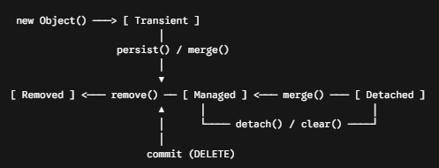

# Ciclo de vida JPA

## O que é?
No JPA, o Ciclo de Vida de uma Entidade representa os diferentes estados em que um objeto Java pode estar em relação ao Contexto de Persistência (gerenciado pelo EntityManager do Hibernate).

---

## Os 4 Estados da Entidade

|         ESTADO         |                                                                   DESCRICAO                                                                   |      ESTÁ NO BANCO?       | O `EntityManager` monitora? |
|:----------------------:|:---------------------------------------------------------------------------------------------------------------------------------------------:|:-------------------------:|:-------------------------:|
|   `Transient`(Novo)    |                                        Objeto instanciado via `new`, sem ID e sem vínculo com a sessão.                                         |          ❌ Não           |          ❌ Não           |
| `Managed`(Gerenciado)  | Objeto associado ao Contexto de Persistência. Qualquer alteração (`setter`) será salva automaticamente no commit da transação (Dirty Checking). |   🟢 Sim (ou vai estar)   |          🟢 Sim           |
| `Detached`(Destacado)  |                  Objeto que já foi gerenciado, possui ID, mas a sessão (`EntityManager`) foi fechada ou ele foi desvinculado.                   |          🟢 Sim           |          ❌ Não           |
|  `Removed`(Removido)   |                             Objeto marcado para exclusão no banco de dados assim que a transação for confirmada.                              | 🟡 Prester a ser excluído |          🟢 Sim           |

## Transições de Estado no EntityManager



### Principais Métodos:
- `persist(entity)`: Transforma um objeto `Transient` em `Managed`.
- `merge(entity)`: Reanexa um objeto `Detached` ao contexto (retorna uma nova instância Managed).
- `remove(entity)`: Transforma um objeto `Managed` em `Removed`.
- `detach(entity)` / `clear()`: Remove uma entidade específica (ou todas) do contexto de persistência, tornando-as `Detached`.
- `flush()`: Força a sincronização imediata dos objetos `Managed` com o banco de dados SQL (sem fechar a transação).


### O que é Dirty Checking?
O Dirty Checking (Checagem de Sujeira) é um mecanismo automático do Hibernate:
- Quando uma entidade está no estado `Managed`, o Hibernate guarda um "snapshot" do seu estado original.
- Se você usar um método `setter` (ex: `cliente.setNome("Novo Nome")`), o Hibernate detecta a alteração.
- Ao finalizar a transação, o Hibernate gera e executa o comando `UPDATE` no SQL automaticamente, sem você precisar chamar `repository.save()` ou `update()`.
 

### Callbacks do Ciclo de Vida (Anotações)
Você pode interceptar momentos específicos do ciclo de vida diretamente na Entidade:

```sql
@Entity
@Table(name = "tb_produtos")
public class Produto {

    @Id
    @GeneratedValue(strategy = GenerationType.IDENTITY)
    private Long id;

    private LocalDateTime dataCriacao;
    private LocalDateTime dataAtualizacao;

    @PrePersist
    public void prePersist() {
        this.dataCriacao = LocalDateTime.now();
    }

    @PreUpdate
    public void preUpdate() {
        this.dataAtualizacao = LocalDateTime.now();
    }
}
```

- `@PrePersist` / `@PostPersist`: Executado antes/depois de salvar no banco pela primeira vez.
- `@PreUpdate` / `@PostUpdate`: Executado antes/depois de atualizar um registro existente.
- `@PreRemove` / `@PostRemove`: Executado antes/depois de deletar.
- `@PostLoad`: Executado logo após os dados serem carregados do banco para o Java.

### Resumo Rápido
- `Transient`: Objeto apenas em memória (`new Produto()`).
- `Managed`: Monitorado pelo JPA; alterações viram `UPDATE` automático (Dirty Checking).
- `Detached`: Fora da sessão; alterações em `setters` são ignoradas pelo banco até chamar merge(). 
- `Removed`: Agendado para `DELETE`.

---